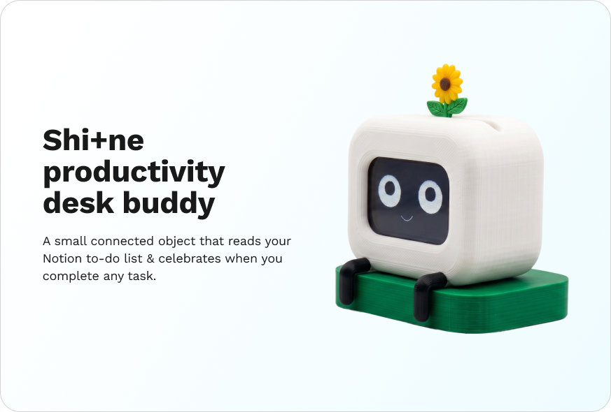

<p align="center">
  
</p>

<h1 align="center">
  
</h1>

<p align="center">
  A productivity desk companion that watches your Notion to-do list
  and raises a flower when you finish a task.
</p>

<p align="center">
  <a href="docs/BUILD_GUIDE.md">Build guide</a> ·
  <a href="docs/WIRING.md">Wiring reference</a>
</p>

---

## What it is

Shi+ne sits on the corner of your desk and watches your Notion to-do list. When you mark a task complete, it lifts a sunflower from its head on a servo arm, animates a celebration on its LCD face, and returns to a soft idle state. Tap it once and it acknowledges the touch. Tap it five times and it gets visibly annoyed.

Part status display, part desk pet, part accountability companion. Built on an Adafruit ESP32 V2 Feather, a 3.5" SPI touch LCD, a micro servo, and the Notion API.

## Hardware

| Component | Notes |
|---|---|
| Adafruit ESP32 V2 Feather | Built-in WiFi, 2MB PSRAM (needed for off-screen sprite rendering) |
| 3.5" ILI9486 SPI touch LCD | 480×320, resistive touch |
| Smraza SG90 micro servo | Or any equivalent 5V hobby servo |
| USB-C cable and 5V wall adapter | Powers the whole device |
| PLA filament | White for body, dark green for base, yellow for flower |
| Perfboard, 14× silicone-jacketed wires, M2 fasteners | For the final assembly |

## Quick start

If you just want to flash and go:

1. Clone the repo
2. Open `firmware/shine/shine.ino` in Arduino IDE
3. Install the four required libraries: TFT_eSPI, ESP32Servo, ArduinoJson, HTTPClient
4. Configure TFT_eSPI's `User_Setup.h` for the ILI9486 board (see the build guide)
5. Fill in your WiFi credentials and Notion API details at the top of the file
6. Flash to an ESP32 V2 Feather wired according to [docs/WIRING.md](docs/WIRING.md)

For the full process including 3D printing the body and final assembly, see [docs/BUILD_GUIDE.md](docs/BUILD_GUIDE.md).

## Wiring

The display ships with documentation written for Raspberry Pi. Translating to the ESP32 V2 took most of a week the first time around. The full table is in [docs/WIRING.md](docs/WIRING.md). Two non-obvious things to know up front:

- The backlight runs on 5V, not 3.3V. Route it to USB VBUS or the screen stays dark.
- LCD_CS and TP_CS are different chip selects on the same SPI bus. Confusing them gives you a working display with no touch, or working touch with no display.

## Architecture

Shi+ne runs three concurrent loops on the ESP32, coordinated by a state machine:

- **Display loop** renders expression sprites into a PSRAM-backed off-screen buffer, then flips to the LCD via SPI. Off-screen rendering removes the visible flash between frames.
- **Polling loop** runs on core 0 as a FreeRTOS task. It hits the Notion API every three seconds, parses the JSON response with streaming, and writes the count under a mutex. The main loop never blocks on HTTP.
- **Interaction loop** reads the touch controller, debounces, and classifies single taps from rapid multi-taps.

Shi+ne also includes a multi-app mode system: the main Shi+ne face, a Flappy Bird game, and a Windows 10-style tile launcher accessed by holding the screen for five seconds.

## Repository structure

```
firmware/   Arduino sketches and TFT_eSPI configuration notes
cad/        Print-ready STL files
docs/       Build guide, wiring reference, images, GIFs
```

## Forking and modifying

Shi+ne is dual-licensed so the source code and the hardware/design work can each use the license that suits them best:

- **Firmware source code** (everything under `firmware/`) — **MIT License**. Reuse it in any project, open or closed, as long as you keep the copyright notice.
- **Hardware designs, CAD files, build guide, wiring reference, README, and images** — **Creative Commons Attribution-ShareAlike 4.0 International (CC BY-SA 4.0)**. Remix the body, fork the docs, build variants — and share your derivative work back under the same license.

Both halves require attribution: credit the original project (Shi+ne), name the original authors (Ayushi Sharma and Neha Sadaye), and link back to this repository.

If you build a variant, open an issue on this repo and link to it. We would love to see what you make.

## License

Dual-licensed: **MIT** for the firmware source code, **CC BY-SA 4.0** for the hardware designs, documentation, and other assets. See [LICENSE](LICENSE) for the overview and [LICENSES/](LICENSES/) for the full legal text of each.
